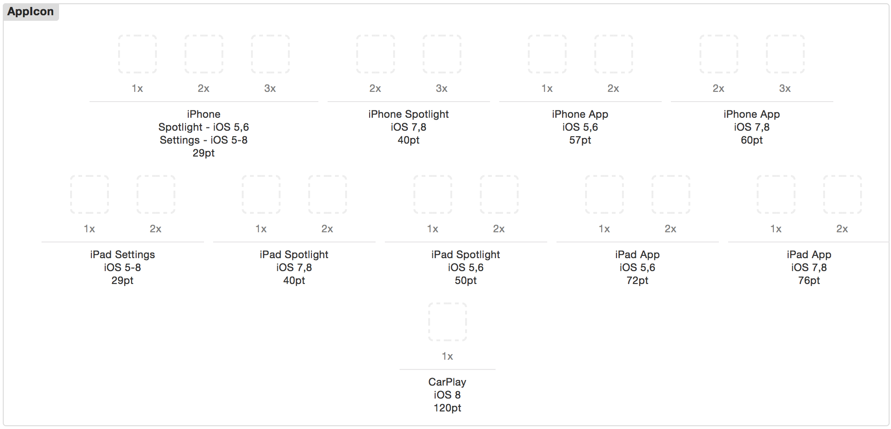

# diversify

Script for quickly creating varying sizes of app icons for iOS project asset catalogs. 

## Example

Say you have a large `512px` or `1024px` version of your app icon called `Icon.png`. For a standard asset catalog, you need these sizes: 



Boy, that's a pain. 

```bash
$ diversify Icon.png

Creating 1x icons...
./Icon-29.png 29x29
./Icon-40.png 40x40
./Icon-50.png 50x50
./Icon-57.png 57x57
./Icon-72.png 72x72
./Icon-76.png 76x76
./Icon-120.png 120x120

Creating 2x icons...
./Icon-29@2x.png 58x58
./Icon-40@2x.png 80x80
./Icon-50@2x.png 100x100
./Icon-57@2x.png 114x114
./Icon-60@2x.png 120x120
./Icon-72@2x.png 144x144
./Icon-76@2x.png 152x152

Creating 3x icons...
./Icon-29@3x.png 87x87
./Icon-40@3x.png 120x120
./Icon-60@3x.png 180x180
```

Just edit the top of the script if you need to modify the sizes created. 

```bash
sizes1x="29 40 50 57 72 76 120"
sizes2x="29 40 50 57 60 72 76"
sizes3x="29 40 60"
```

And yes, a shipping app should probably take more care than this and hand-create each size of icon. This is mostly for dev apps and distribution. 
